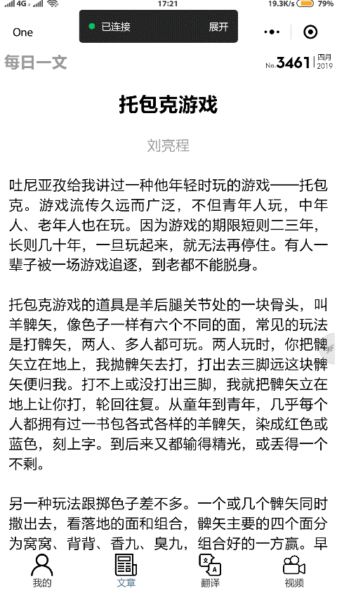

# OneDay
每日推荐视频文章的小程序

### 前言
这个小程序的灵感来自韩寒先生的 One，具有每日推荐一文，每日推荐视频和带有百度翻译功能，也是我学习微信小程序的练手项目，至于 UI 部分没做具体的设计，所以就不要为难我了

### 关于接口数据
每日一文使用的是每日一文的 API
每日视频使用的是开眼首页推荐视频 API
百度翻译使用的是百度翻译的开源 API

### 效果图

### 目标功能
每日推荐一文
随机一文
每日一文转发
LIKE
8 种翻译的切换（英文, 中文, 粤语, 日语, 韩语, 法语, 德语）
个人中心的登录
视频封面图
视频页加载 Loading
视频页播放当前视频，上一播放视频暂停
